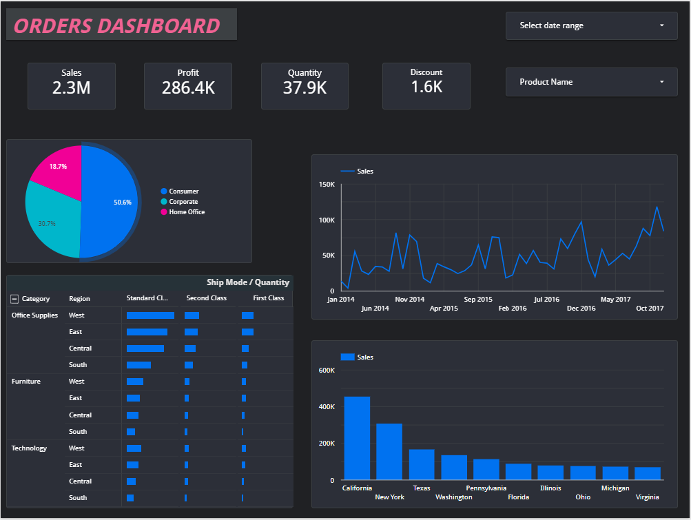

# LookerStudio-Orders-Dashboard
Interactive Orders Dashboard built with Looker Studio for sales and order performance analysis.
# Looker Studio Orders Dashboard

## Overview

An interactive Orders Dashboard created in Looker Studio to monitor sales performance, profit, quantity, discounts, and regional analysis.

## Features

- KPI Cards
- Interactive Filters
- Sales Trend Analysis
- Sales by State
- Customer Segment Distribution
- Ship Mode Analysis

## Tools Used

- Looker Studio
- Data Visualization
- Interactive Filters

## Dashboard Preview

